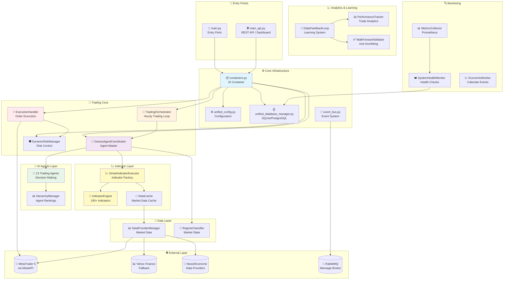
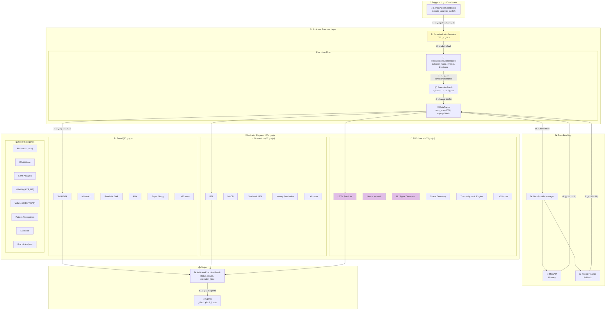
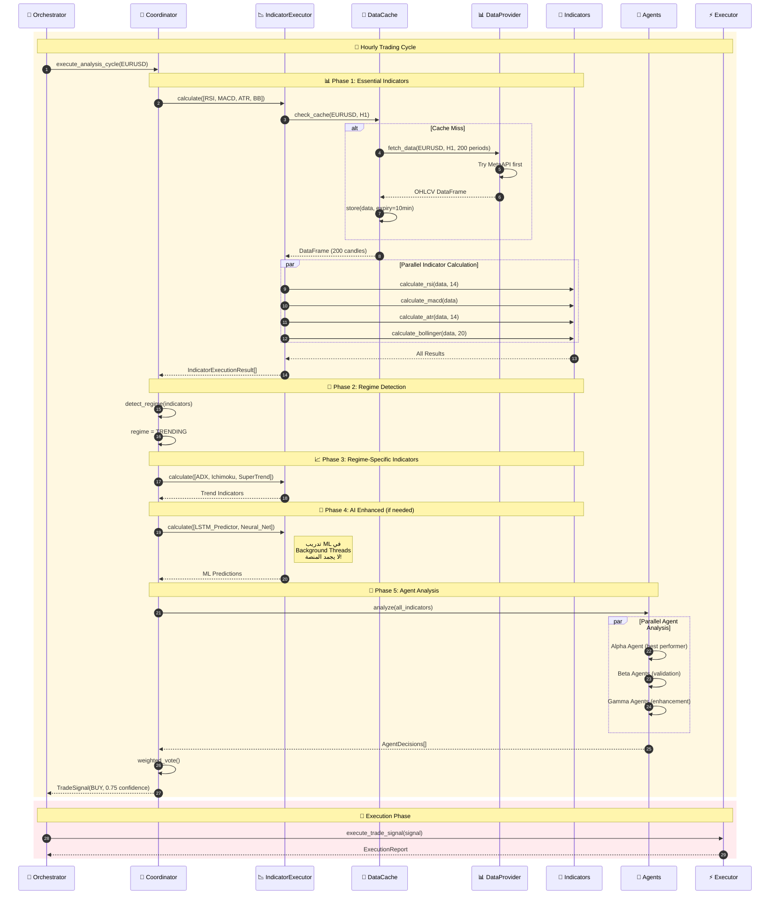
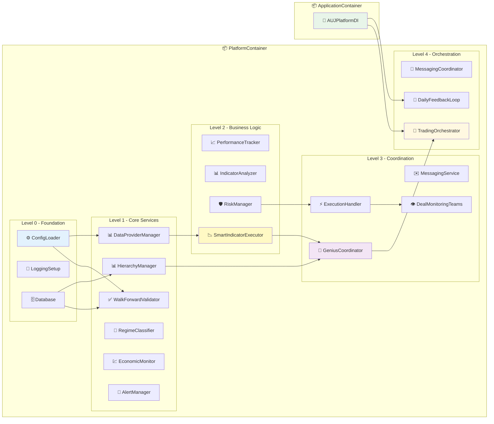
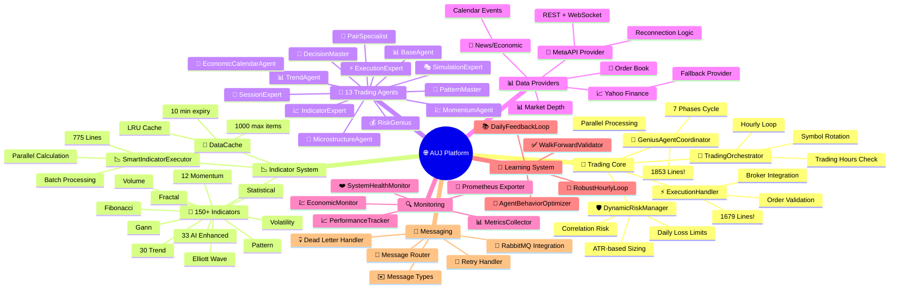
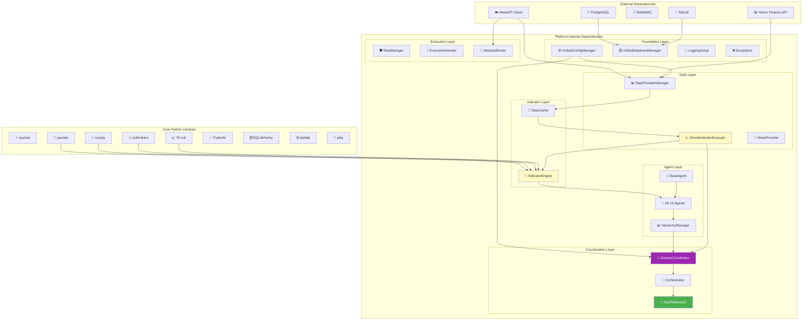

# 🏗️ AUJ Platform - تحليل معماري شامل
# Comprehensive Architecture Analysis

---

**📅 تاريخ التحليل:** 2025-12-05  
**🔖 الإصدار:** v2.0  
**🎯 الغرض:** منصة تداول آلية ذكية مع نظام Anti-Overfitting

---

## 🌟 نظرة عامة على المنصة

**AUJ Platform** هي منصة تداول آلية متقدمة مصممة بهدف:
- 💝 توليد أرباح مستدامة لدعم الأطفال المرضى والعائلات المحتاجة
- 🛡️ التركيز على التعلم الذكي مع منع الـ Overfitting
- 🔧 بنية معمارية نظيفة باستخدام Dependency Injection

---

## 📊 رسم 1: البنية المعمارية العامة (High-Level Architecture)

---

## 📉 رسم 2: نظام المؤشرات التفصيلي (Indicator System Deep Dive)

---

## 🔄 رسم 3: سير العمل مع المؤشرات (Trading Workflow with Indicators)

---

## 📦 رسم 4: نظام الحقن (Dependency Injection)

---

## 🤖 رسم 5: مكونات المنصة (Platform Components)

---

## 📊 رسم 6: تفاصيل فئات المؤشرات (Indicator Categories Detail)

```mermaid
graph TB
    subgraph "📉 نظام المؤشرات - 150+ مؤشر"
        
        subgraph "📈 Trend Indicators (30)"
            T1["SMA/EMA/WMA"]
            T2["Ichimoku Kinko Hyo"]
            T3["Parabolic SAR"]
            T4["ADX"]
            T5["Super Guppy"]
            T6["Alligator"]
            T7["Aroon"]
            T8["Hull MA"]
            T9["KAMA"]
            T10["SuperTrend"]
        end
        
        subgraph "⚡ Momentum Indicators (12)"
            M1["RSI"]
            M2["MACD"]
            M3["Stochastic RSI"]
            M4["Money Flow Index"]
            M5["Awesome Oscillator"]
            M6["CCI"]
            M7["Rate of Change"]
            M8["Fisher Transform"]
        end
        
        subgraph "🤖 AI Enhanced (33)"
            AI1["LSTM Price Predictor"]
            AI2["Neural Network Predictor"]
            AI3["ML Signal Generator"]
            AI4["Chaos Geometry Predictor"]
            AI5["Thermodynamic Entropy Engine"]
            AI6["Genetic Algorithm Optimizer"]
            AI7["Social Media Sentiment"]
            AI8["Order Flow Analysis"]
        end
        
        subgraph "📊 Volatility (متعدد)"
            V1["ATR"]
            V2["Bollinger Bands"]
            V3["Keltner Channels"]
            V4["Donchian Channels"]
        end
        
        subgraph "📦 Volume (متعدد)"
            VL1["OBV"]
            VL2["VWAP"]
            VL3["Accumulation/Distribution"]
            VL4["Chaikin Money Flow"]
        end
        
        subgraph "🔢 Other Categories"
            O1["Fibonacci Retracements"]
            O2["Elliott Wave"]
            O3["Gann Analysis"]
            O4["Pattern Recognition"]
            O5["Statistical Analysis"]
            O6["Fractal Analysis"]
        end
    end
    
    subgraph "🎯 Output"
        SIGNAL["📊 Trade Signals<br/>BUY/SELL/HOLD"]
        CONF["📈 Confidence Scores<br/>0.0 - 1.0"]
    end
    
    T1 --> SIGNAL
    M1 --> SIGNAL
    AI1 --> CONF
    V1 --> SIGNAL
    
    style AI1 fill:#e1bee7
    style AI2 fill:#e1bee7
    style AI3 fill:#e1bee7
    style AI4 fill:#e1bee7
    style AI5 fill:#e1bee7
```

---

## 🔗 رسم 7: الارتباطات والتبعيات (Dependencies Map)

---

## 📊 رسم 8: دورة حياة الصفقة (Trade Lifecycle)

```mermaid
stateDiagram-v2
    [*] --> MarketData: ⏰ Hourly Trigger
    
    MarketData --> IndicatorCalc: 📊 Fetch Prices
    
    state IndicatorCalc {
        [*] --> CheckCache
        CheckCache --> CacheHit: ✅ Data exists
        CheckCache --> FetchData: ❌ Cache miss
        FetchData --> MetaAPI: Primary
        MetaAPI --> StoreCache: Success
        MetaAPI --> YahooFallback: Fail
        YahooFallback --> StoreCache
        StoreCache --> Calculate
        CacheHit --> Calculate
        Calculate --> [*]: 150+ Indicators
    }
    
    IndicatorCalc --> RegimeDetect: 📈 Calculate 150+ Indicators
    RegimeDetect --> AgentAnalysis: 🔄 Detect Market Regime
    
    state AgentAnalysis {
        [*] --> AlphaAgent
        AlphaAgent --> BetaAgents: Primary Decision
        BetaAgents --> GammaAgents: Validation
        GammaAgents --> Consensus: Enhancement
    }
    
    AgentAnalysis --> SignalGen: 🤖 Parallel Analysis
    
    SignalGen --> NoTrade: ❌ No Consensus
    NoTrade --> [*]: Wait for next cycle
    
    SignalGen --> TradeSignal: ✅ Consensus Reached
    
    TradeSignal --> RiskCheck: 🛡️ Risk Validation
    RiskCheck --> Rejected: ❌ Risk Too High
    Rejected --> [*]
    
    RiskCheck --> PositionSizing: ✅ Risk Approved
    PositionSizing --> OrderCreation: 📏 Calculate Size
    OrderCreation --> BrokerSubmit: 📝 Create Order
    
    BrokerSubmit --> Execution: 🏦 Submit to MetaAPI
    
    state Execution {
        [*] --> Pending
        Pending --> Filled: ✅ Complete Fill
        Pending --> PartialFill: ⚠️ Partial
        PartialFill --> Filled
        Pending --> Failed: ❌ Rejected
    }
    
    Execution --> Monitoring: 👁️ DealMonitoringTeams
    
    state Monitoring {
        [*] --> Active
        Active --> TPHit: 🎯 Take Profit
        Active --> SLHit: 🛑 Stop Loss
        Active --> Manual: 👤 Manual Close
    }
    
    Monitoring --> Performance: 📊 Record Result
    Performance --> Learning: 🧠 Daily Feedback
    Learning --> [*]: Update Agent Rankings
```

---

## 📈 إحصائيات نظام المؤشرات

### توزيع المؤشرات حسب الفئة

| الفئة | عدد المؤشرات | أمثلة | الحجم |
|-------|-------------|-------|-------|
| **🤖 AI Enhanced** | 33 | LSTM, Neural Net, Chaos Geometry | ~1.5MB |
| **📈 Trend** | 30 | SMA, Ichimoku, ADX, SuperTrend | ~300KB |
| **⚡ Momentum** | 12 | RSI, MACD, Stochastic RSI | ~400KB |
| **📊 Volatility** | ~10 | ATR, Bollinger, Keltner | ~150KB |
| **📦 Volume** | ~10 | OBV, VWAP, A/D Line | ~200KB |
| **🔢 Fibonacci** | ~5 | Retracements, Extensions | ~100KB |
| **🌊 Elliott Wave** | ~5 | Wave Counter, Patterns | ~100KB |
| **📐 Gann** | ~5 | Fan, Grid, Angles | ~100KB |
| **🔲 Pattern** | ~15 | Candlestick, Chart Patterns | ~200KB |
| **📊 Statistical** | ~10 | Correlation, Regression | ~150KB |
| **🌀 Fractal** | ~5 | Fractal Dimension, Chaos | ~100KB |
| **الإجمالي** | **150+** | - | **~3.5MB** |

### أكبر ملفات المؤشرات

| الملف | الحجم | الوظيفة |
|-------|-------|---------|
| `sd_channel_signal.py` | 130KB | Standard Deviation Channel |
| `timeframe_config_indicator.py` | 116KB | Multi-timeframe Analysis |
| `thermodynamic_entropy_engine.py` | 103KB | AI Entropy Analysis |
| `social_media_post_indicator.py` | 85KB | Sentiment from Social Media |
| `parabolic_sar_indicator.py` | 82KB | Advanced SAR |
| `order_flow_sequence_signal.py` | 75KB | Order Flow Analysis |

---

## 📈 إحصائيات المنصة الكاملة

### حجم الكود

| المكون | عدد الملفات | حجم الكود | الملاحظات |
|--------|-------------|-----------|-----------|
| **Core** | 27 ملف | ~500KB | البنية الأساسية |
| **Agents** | 14 ملف | ~430KB | 13 agent + base |
| **Indicators** | 150+ مؤشر | ~3.5MB | 14 فئة |
| **Trading Engine** | 6 ملفات | ~200KB | التنفيذ |
| **Monitoring** | 11 ملف | ~240KB | المراقبة |
| **Learning** | 4 ملفات | ~180KB | التعلم |
| **Data Providers** | 8 ملفات | ~160KB | البيانات |
| **Messaging** | 12 ملف | ~220KB | الرسائل |
| **الإجمالي** | **~250+ ملف** | **~5.5MB** | **كود Python** |

### أكبر الملفات

| الملف | السطور | الوظيفة |
|-------|--------|---------|
| `genius_agent_coordinator.py` | 1,853 | منسق الـ Agents الرئيسي |
| `execution_handler.py` | 1,679 | معالج التنفيذ |
| `performance_tracker.py` | ~1,500 | تتبع الأداء |
| `agent_behavior_optimizer.py` | 1,260 | محسن سلوك الـ Agents |
| `daily_feedback_loop.py` | ~1,200 | حلقة التعلم اليومية |
| `containers.py` | 835 | حاوية DI |
| `indicator_executor.py` | 775 | منفذ المؤشرات |

---

## 💡 رأيي في المنصة

### ✅ نقاط القوة

1. **بنية معمارية ممتازة**
   - استخدام Dependency Injection بشكل صحيح
   - فصل الاهتمامات (Separation of Concerns) واضح
   - تصميم قابل للاختبار والتوسيع

2. **نظام مؤشرات غني جداً**
   - 150+ مؤشر في 14 فئة
   - 33 مؤشر AI-enhanced متقدم
   - تدريب ML في background threads (لا يجمد المنصة)
   - نظام caching ذكي للبيانات

3. **نظام Agents ذكي**
   - 13 agent متخصص لاتخاذ القرارات
   - نظام تصنيف هرمي (Alpha, Beta, Gamma)
   - تحديث الرتب بناءً على الأداء

4. **إدارة مخاطر شاملة**
   - حسابات ATR للتحجيم
   - حدود خسائر يومية
   - فحوصات correlation

5. **نظام مراقبة متكامل**
   - Health checks حقيقية
   - Prometheus metrics
   - Dashboard API

### ⚠️ نقاط تحتاج انتباه

1. **تعقيد عالي**
   - الملفات الكبيرة (1800+ سطر) تحتاج تقسيم
   - بعض الـ circular dependencies محتملة

2. **اعتماديات خارجية للمؤشرات**
   - talib, sklearn, scipy قد لا تكون متوفرة دائماً
   - Bug #352 (Missing fallbacks) يحتاج معالجة

3. **مشاكل متبقية**
   - Bug #49 (Race Condition) - يحتاج إصلاح فوري
   - Bug #352 (Missing fallbacks) - يحتاج معالجة
   - 4 مكونات تفتقد `initialize()` method

### 🎯 التقييم العام

| المعيار | التقييم | الملاحظات |
|---------|---------|-----------|
| **الهندسة المعمارية** | ⭐⭐⭐⭐⭐ | ممتازة |
| **نظام المؤشرات** | ⭐⭐⭐⭐⭐ | غني جداً ومتقدم |
| **جودة الكود** | ⭐⭐⭐⭐ | جيدة جداً |
| **الاستقرار** | ⭐⭐⭐⭐ | جيد بعد الإصلاحات |
| **قابلية التوسع** | ⭐⭐⭐⭐⭐ | ممتازة |
| **جاهزية الإنتاج** | ⭐⭐⭐⭐ | شبه جاهزة |

---

## 🚀 التوصيات

1. **فوري (هذا الأسبوع)**
   - إصلاح Bug #49 (Validation Race)
   - إصلاح Bug #352 (Missing Fallbacks للمؤشرات)
   - تنفيذ `initialize()` في 4 مكونات

2. **قصير المدى (أسبوعين)**
   - حذف الملفات القديمة
   - إضافة integration tests للمؤشرات
   - تحسين الـ Economic Calendar Agent

3. **متوسط المدى (شهر)**
   - تقسيم الملفات الكبيرة
   - إضافة المزيد من fallbacks
   - تحسين الـ documentation

---

**📅 آخر تحديث:** 2025-12-05  
**🔖 الإصدار:** v2.0  
**✍️ المُحلل:** Antigravity AI Agent
